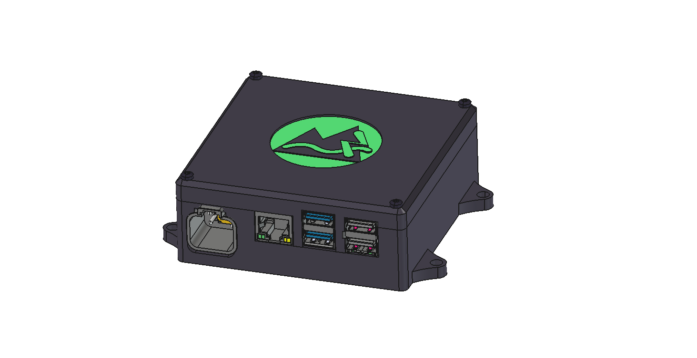

# TrailCurrent In-Vehicle Compute



Dockerized edge gateway with MQTT broker, tile server, and local dashboards. Part of the [TrailCurrent](https://trailcurrent.com) open-source vehicle platform.

## Quick Navigation

| I want to... | Go here |
|--------------|---------|
| Set up a development environment | [Development Setup](#development-setup) below |
| Build a CM5 image or deployment package | [Building for CM5 Devices](#building-for-cm5-devices) below |
| Flash and set up a new CM5 device | [CM5/SETUP.md](CM5/SETUP.md) |
| Update an existing device | [PI_DEPLOYMENT.md](PI_DEPLOYMENT.md) |
| Understand cloud OTA updates | [OTA_DEPLOYMENT_IMPLEMENTATION.md](OTA_DEPLOYMENT_IMPLEMENTATION.md#cloud-to-pi-ota-deployment-deployment-watcher) |

## Prerequisites

- **Hardware:** Raspberry Pi Compute Module 5 (CM5) on a standard carrier board with Waveshare RS485 CAN HAT (B) — no custom components or soldering required. The CM5 + carrier board replaces the previous Pi 5 + NVME Base + custom CAN HAT stack: it's more compact, more readily available, cheaper, and can be fully assembled from off-the-shelf parts.
- **Docker Engine** (or Docker Desktop) with the `compose` plugin and `buildx`
- **Git**

---

## Development Setup

This gets your local development environment running with hot-reload and debugging enabled. All services build from local Dockerfiles for the host platform.

### Step 1: Clone and configure environment

```bash
git clone <REPO_URL>
cd TrailCurrentHeadwaters
git config core.hooksPath .githooks
docker buildx use default
cp .env.example .env
```

### Step 2: Generate secure random values

```bash
# Generate ENCRYPTION_KEY (64 character hex string)
openssl rand -hex 32
```

Copy the value into `ENCRYPTION_KEY` in `.env`.

### Step 3: Edit `.env` and set your values

- `ENCRYPTION_KEY` - Paste the value from step 2
- `ADMIN_PASSWORD` - Strong password for system admin access
- `MQTT_USERNAME` - Username for MQTT broker
- `MQTT_PASSWORD` - Password for MQTT broker (plain text - auto-added to broker at startup)
- `TLS_CERT_HOSTNAME` - Your device's hostname (e.g., `trailcurrent01.local`)

### Step 4: Generate SSL certificates

```bash
./scripts/generate-certs.sh
# Select option 1 for Development or option 2 for Production
```

See [SSL Certificate Generation](#ssl-certificate-generation) for details.

### Step 5: Obtain map tiles

The tileserver requires a pre-generated mbtiles file to serve map data.

```bash
mkdir -p data/tileserver
# Place your tiles file at: data/tileserver/map.mbtiles
```

**How to get tiles:**
- **Download from OpenStreetMap:** Use the [PbfTileConverter](https://github.com/onthegomap/planetiler) utility or a service like [Protomaps](https://protomaps.com/) to generate tiles from OSM data (see [DOCS/UpdatingMapTiles.md](DOCS/UpdatingMapTiles.md))
- **Copy from a team member:** Copy `map.mbtiles` from an existing machine

A single US state (~200 MB - 2 GB) works fine for development. Full US coverage is ~10-25 GB.

### Step 6: Build and start in development mode

```bash
docker compose -f docker-compose.yml -f docker-compose.dev.yml up -d --build
```

The `--build` flag ensures all images are built from local Dockerfiles for your host platform. Development mode enables:
- Hot-reload for frontend and backend code changes
- Node.js debug port (9229) for VSCode debugger attachment
- MongoDB accessible on localhost:27017
- Tileserver styles hot-reload

Containers will automatically:
- Create the mosquitto password file from your credentials
- Initialize all services with consistent credentials
- Mount the SSL certificates for HTTPS/MQTTS communication
- Load map tiles from the mbtiles file

### Verification Checklist

After startup, verify all services are healthy:

```bash
# All 5 containers should be running
docker compose ps

# Frontend loads
curl -k https://localhost/

# Tileserver healthy
curl http://localhost:8080/health

# Map style served
curl -s http://localhost:8080/styles/3d-dark/style.json | head -5

# Font glyphs available
curl -s -o /dev/null -w "%{http_code}" "http://localhost:8080/fonts/Noto%20Sans%20Regular/0-255.pbf"
# Expected: 200
```

**Access the web UI:** https://localhost (accept the self-signed certificate warning)

### Security Notes

- `.env` is in `.gitignore` - will never be committed
- Use strong, randomly generated passwords for all credentials
- All values in `.env.example` are placeholders only
- Passwords are auto-hashed/auto-configured at container startup

---

## Building for CM5 Devices

There are two ways to get the application onto a CM5 device:

### Option A: Build a Complete CM5 Image (Recommended for New Devices)

The CM5 image includes everything — OS, Docker, application containers, map
tiles, and configuration. After flashing, the user just sets passwords via
an interactive wizard on first SSH login.

**Prerequisites (files not in the repo that you must provide):**

| File | How to get it |
|------|---------------|
| `images/*.tar` | Run `./build-and-save-images.sh` (builds ARM64 Docker images) |
| `data/tileserver/map.mbtiles` | Download from OSM data or copy from a team member (see [DOCS/UpdatingMapTiles.md](DOCS/UpdatingMapTiles.md)) |

**Build the image:**
```bash
# 1. Build ARM64 Docker images (~10 min first time)
./build-and-save-images.sh

# 2. Ensure map.mbtiles exists at data/tileserver/map.mbtiles

# 3. Build the CM5 image (bakes in Docker images, map tiles, app code, configs)
cd CM5/image
sudo ./build.sh myuser mypassword
```

The output image (~28 GB) is flashed to NVMe via `dd`. See [CM5/SETUP.md](CM5/SETUP.md)
for the full flashing and setup procedure.

### Option B: Build a Deployment Package (For Updating Existing Devices)

For updating devices that already have an image flashed, create an offline
deployment zip:

```bash
# Build everything and create the zip
./create-deployment-package.sh --version=1.0.0
```

This will:
1. Build all 4 service images for `linux/arm64` (plus pull `mongo:7`)
2. Save images as `.tar` files in `images/`
3. Fetch MCU firmware from GitHub releases (if available)
4. Package everything into `trailcurrent-deployment-1.0.0.zip`

**Transfer and deploy to device:**
```bash
scp trailcurrent-deployment-1.0.0.zip myuser@headwaters.local:~
# On the device:
unzip -o trailcurrent-deployment-1.0.0.zip && ./deploy.sh
```

Replace `myuser` with the username configured when the CM5 image was built.

See [PI_DEPLOYMENT.md](PI_DEPLOYMENT.md) for detailed deployment instructions.

> **Note:** `build-and-save-images.sh` is a prerequisite for both options.
> The CM5 image build (`build.sh`) and the deployment package
> (`create-deployment-package.sh`) both consume the `images/*.tar` files
> it produces.

---

## Architecture

### Services

The application runs 5 Docker containers:

| Service | Purpose |
|---------|---------|
| **frontend** | nginx serving the MapLibre GL PWA (HTTPS on port 443) |
| **backend** | Node.js Express API with MQTT, CAN bridge, and cloud bridge |
| **mosquitto** | Eclipse Mosquitto MQTT broker (TLS on port 8883) |
| **mongodb** | MongoDB 7 document database |
| **tileserver** | Custom vector tile server with styles, fonts, and sprites |

### CAN Bus Bridge

The backend includes a built-in CAN bridge service (`src/services/can-bridge.js`) that:
- Subscribes to `can/inbound` MQTT messages from the host-side Python CAN-to-MQTT bridge
- Routes by CAN identifier and parses bit-array data into structured JSON
- Publishes to `local/*` MQTT topics (lights, relays, energy, GPS, air quality, leveling)
- Sends outbound CAN commands for light toggles, brightness, and relay control

### Cloud Bridge

When cloud synchronization is enabled in Settings, the backend connects a second MQTT client to the Farwatch cloud broker over cellular LTE (`src/services/cloud-bridge.js`):

- **Cloud to Local (Commands):** `rv/lights/N/command` triggers CAN toggle, `rv/thermostat/command` passes through to local
- **Cloud to Local (Proximity):** `rv/proximity/event` and `rv/proximity/status` are forwarded to `local/proximity/*` and broadcast via WebSocket. These events are published by the Farwatch proximity engine when a registered phone enters or leaves a distance zone around the vehicle. The automation rules themselves execute on Farwatch (publishing light/relay commands via the existing `rv/lights/*/command` and `rv/relays/*/command` topics), so no rule processing happens on the vehicle. The forwarded events are available for future Overlook UI display.
- **Local to Cloud (Status):** Forwarded using three data-saving mechanisms to stay within a 10 GB/month cellular budget:
  - **Change detection** — Messages identical to the last-sent value are suppressed. Lights and relays (65% of raw CAN traffic) broadcast unchanged state every second; change detection eliminates ~99% of these.
  - **Tiered intervals** — Each data type has a minimum send interval: immediate (lights, relays, thermostat — on change only), 5 seconds (energy, GPS position — with threshold bypass for significant changes), 15 seconds (altitude, air quality, leveling), 30 seconds (system stats). GPS time is not forwarded (Farwatch has its own clock).
  - **Heartbeat** — Every 20 seconds, all last-known state is republished to the cloud as a safety net for connection-level failures. In normal operation, state changes are forwarded immediately via MQTT QoS 1.
- **Config sync:** System config snapshot published as retained message on cloud connect, plus forced full-state heartbeat on reconnect

### SMS Notifications

The system can send SMS text messages through a cellular router's `sendsms` command via SSH. This is configured in **Settings > SMS Notifications**:

- **Phone Number** — Destination phone number (e.g., `+15551234567`)
- **Router IP Address** — LAN IP of the cellular router
- **SSH Private Key** — Private key for passwordless SSH as `root` to the router

To set up SSH access to the router:

```bash
# Generate an SSH key (if you don't already have one)
ssh-keygen -t ed25519

# Copy the public key to the router
ssh-copy-id root@<router-ip>
```

The private key (typically `~/.ssh/id_ed25519`) is pasted into the settings field and stored encrypted in the database. Use the **Send Test SMS** button to verify the configuration.

### Alarm System

The alarm feature provides SMS notifications when device state changes are detected. A toggle on the home screen enables/disables the alarm. When enabled, the system monitors CAN bus status messages and sends an SMS when a device's state changes.

**How it works:**

1. The MQTT service tracks the last known state of each device from CAN bus messages
2. When a new status message reports a different state than the cached value, the alarm fires
3. Notifications are grouped by device type, each with its own independent cooldown (default 60 seconds)
4. Multiple state changes within the same group's cooldown window result in a single SMS

**Alarm groups:**

| Group | Source | Trigger |
|-------|--------|---------|
| `light` | PDM/Torrent light controllers | Light state change (on/off) |
| `relay` | Switchback relay modules | Relay state change (on/off) |
| `energy` | Energy monitor | (future) |
| `airquality` | Air quality sensor | (future) |
| `thermostat` | Thermostat | (future) |
| `level` | Leveling system | (future) |
| `gps` | GPS/GNSS | (future) |

Groups are defined in `MqttService.ALARM_GROUPS` in `containers/backend/src/mqtt.js`. Each group can be configured with its own cooldown period, and the architecture supports per-group settings for whether every event or only the first event in a window should trigger an SMS.

**SMS message content:**

- If cloud is enabled: `Unexpected event occurred, check Farwatch for details <cloud_url>`
- If cloud is not enabled: `Unexpected event occurred`

**Requirements:** SMS must be configured and enabled in Settings for alarm notifications to be sent.

### Host-Side Services

Python scripts running as systemd services on the host (outside Docker):
- `can-to-mqtt.py` — Bridges the physical CAN bus (`can0`) to MQTT topics (`can/inbound`, `can/outbound`)
- `discovery-mdns.py` — Discovers MCU modules on the local network via mDNS
- `deployment-watcher.py` — Monitors for OTA deployment updates from the cloud

---

## Project Structure

```
containers/          Dockerfiles for each service
  frontend/          nginx + MapLibre GL web UI
  backend/           Node.js Express API + CAN bridge + cloud bridge
  mosquitto/         Eclipse Mosquitto MQTT broker
  tileserver/        Custom tile server (styles, fonts, sprites)
config/              Version-controlled service configurations
  mosquitto/         mosquitto.conf
data/                Runtime data (gitignored)
  keys/              TLS certificates
  tileserver/        map.mbtiles (~25 GB, not in repo)
images/              ARM64 Docker image tarballs (gitignored, built by build-and-save-images.sh)
local_code/          Python host services (CAN-to-MQTT bridge, deployment watcher, OTA helpers)
scripts/             Utility scripts (cert generation)
CM5/                 CM5 image build system, flashing tools, setup guide
```

**Docker Compose files:**
- `docker-compose.yml` — Production orchestration (5 services)
- `docker-compose.dev.yml` — Development overrides (hot-reload, debug ports)

---

## SSL Certificate Generation

The application uses TLS/SSL for secure communication. Certificates must be generated before running `docker compose up`. The `scripts/generate-certs.sh` script supports two modes:

### Quick Reference

```bash
# Interactive mode (prompts for selection)
./scripts/generate-certs.sh

# Non-interactive mode (development)
./scripts/generate-certs.sh 1

# Non-interactive mode (production)
./scripts/generate-certs.sh 2

# Using environment variable
CERT_MODE=2 ./scripts/generate-certs.sh

# Show help
./scripts/generate-certs.sh --help
```

### Development Certificates (Local Testing)

For local development with `localhost` or `127.0.0.1`:

```bash
./scripts/generate-certs.sh 1
```

**Development certificates include:**
- DNS names: `localhost`, plus your `TLS_CERT_HOSTNAME` from `.env`
- IP addresses: `127.0.0.1`, `::1` (IPv6 localhost)

**Access locally:**
```
https://localhost           - Frontend (HTTPS)
```

Accept the self-signed certificate warning in your browser (one-time).

### Production Certificates (Deployment)

For deployed devices accessed from other machines on the network:

1. **Set your device's hostname** in `.env`:
   ```
   TLS_CERT_HOSTNAME=trailcurrent01.local
   ```

2. **Generate production certificates:**
   ```bash
   ./scripts/generate-certs.sh 2
   ```

3. **Install the CA certificate** (`data/keys/ca.crt`) on devices that will access the web UI.

4. **Access from the network:**
   ```
   https://trailcurrent01.local       - Web UI
   mqtts://trailcurrent01.local:8883  - MQTT broker
   ```

### Regenerating Certificates

Run the script anytime to regenerate. It will prompt before overwriting existing certificates and create backups.

```bash
./scripts/generate-certs.sh
docker compose restart
```

Certificates are automatically protected by `.gitignore`. Never commit them to version control.

---

## Docker

### Running Containers

```bash
# Development mode (hot-reload, debug ports) — always use --build to ensure local images
docker compose -f docker-compose.yml -f docker-compose.dev.yml up -d --build

# Production mode (after verification)
docker compose up -d --build
```

### Docker Networking

**MongoDB Access:**
- Services communicate via Docker's internal network: `mongodb:27017`
- MongoDB is NOT exposed to localhost (127.0.0.1)
- To access MongoDB from your host: `docker compose exec mongodb mongosh`

Docker containers use service names for inter-container communication.

### Data Persistence

The `data/` directory contains all persistent application data:

- **SSL certificates** (`data/keys/`) — Generated once, valid for 10 years
- **Map tiles** (`data/tileserver/map.mbtiles`) — Set up once, rarely updated
- **MongoDB** — Named volume `mongodb-data`, persists across rebuilds

**Never delete `data/` during updates** unless performing a complete reset. All data persists across container rebuilds.

**Updating the Application (No Data Loss):**
```bash
git pull
docker compose -f docker-compose.yml -f docker-compose.dev.yml up -d --build
# Certificates, .env, and map tiles are preserved
```

---

## Debugging

### VSCode Node.js Debugger

The backend Node.js server can be debugged using VSCode's built-in debugger. The setup uses `--inspect-brk` to pause the application at startup, waiting for the debugger to attach before continuing execution.

#### Quick Start

1. **Open the project in VSCode** (if not already open)

2. **Start debugging:**
   - Open the Debug panel (Ctrl+Shift+D / Cmd+Shift+D)
   - Select "Backend Debug" from the dropdown
   - Click the green "Start Debugging" button (or press F5)

3. **What happens automatically:**
   - Docker containers start in development mode (`docker-compose -f docker-compose.yml -f docker-compose.dev.yml up`)
   - Backend container starts with `--inspect-brk=0.0.0.0:9229` (pauses at startup)
   - VSCode automatically attaches the debugger to port 9229
   - Application resumes and you can now set breakpoints

4. **Stop debugging:**
   - Press Shift+F5 or click the stop button in the debug panel
   - Docker containers are automatically stopped (`docker-compose down`)

#### Manual Debugging (Without VSCode Integration)

```bash
# Start containers in development mode
docker compose -f docker-compose.yml -f docker-compose.dev.yml up

# In VSCode, attach manually:
# - Open Debug panel (Ctrl+Shift+D)
# - Select "Backend Debug"
# - Click "Start Debugging" (F5)
```

#### Debugging Configuration

The debugging setup is configured in `.vscode/launch.json`:

```json
{
  "name": "Backend Debug",
  "type": "node",
  "request": "attach",
  "port": 9229,
  "address": "localhost",
  "restart": true,
  "skipFiles": ["<node_internals>/**"],
  "outFiles": ["${workspaceFolder}/containers/backend/src/**/*.js"]
}
```

#### Troubleshooting

**"Connection refused" error:**
- Ensure containers are running: `docker compose ps`
- Check backend container logs: `docker compose logs backend`
- Verify port 9229 is exposed: `docker compose port backend 9229`

**Breakpoints not being hit:**
- Verify the file path matches exactly (case-sensitive on Linux)
- Check development mode: `docker compose config | grep "NODE_ENV"`

**Backend container exits immediately:**
- Check logs: `docker compose logs backend`
- Ensure `.env` file is set up correctly
- Verify MongoDB: `docker compose logs mongodb`

**Mosquitto or other containers failing to start:**
- Check logs: `docker compose logs mosquitto`
- Certificate permissions: `chmod 644 data/keys/*.key data/keys/*.crt data/keys/*.pem`

**Port conflicts:**
- Clean up: `docker system prune -f --volumes`
- Verify no containers running: `docker ps -a`
- Restart Docker: `sudo systemctl restart docker`

#### Tips for Effective Debugging

1. **Breakpoint in startServer()** in `src/index.js` to debug initialization
2. **Route breakpoints** in route handlers (e.g., `src/routes/thermostat.js`)
3. **MQTT debugging** via breakpoints in `src/mqtt.js`
4. **CAN bridge debugging** via breakpoints in `src/services/can-bridge.js`
5. **Conditional breakpoints**: Right-click a breakpoint to set conditions
6. **Logpoints**: Right-click line number to log values without pausing

---

## Third-Party Components

TrailCurrent Headwaters is MIT-licensed, but the image-build tooling for the Radxa Dragon Q6A target vendors the **Radxa SDK** ([`RadxaOS-SDK/rsdk`](https://github.com/RadxaOS-SDK/rsdk)) under its original **GPL-3.0-or-later** license. The vendored tree lives at [`RADXAQ6A/image/rsdk/`](RADXAQ6A/image/rsdk/) with its upstream [`LICENSE`](RADXAQ6A/image/rsdk/LICENSE) preserved. rsdk is a build-time tool — it produces the flashable image but is not linked into or shipped inside any TrailCurrent runtime component, so the MIT licensing of the TrailCurrent sources is unaffected.

---
